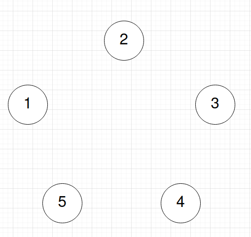
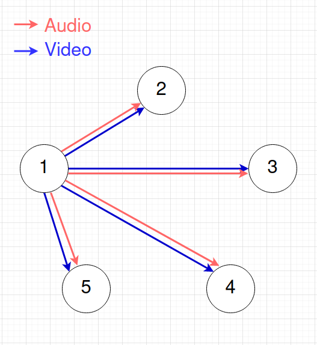

# P2P

Before we introduce concepts such as media servers, SFUs, and MCUs, it's helpful to understand why servers are needed in the first place.  Early versions of KidsLoop Live were completely P2P for Audio and Video, but that had to change as the platform grew.  Let's see why.  

Let's first consider a simple class room with 5 participants.  

And now participant 1 decides they want to share their microphone and camera to all other participants of the room:

As shown, participant 1 needs to create a total of 8 uploading streams, 4 for video and 4 for audio.  If the video [bitrate](https://en.wikipedia.org/wiki/Bit_rate) for each stream was 500Kbps, then participant 1 would need 2Mbps upload speed to serve video to all the other participants.  While in developed countries that might not be too difficult to serve, consider the case where the participants are all based in India, where the median mobile upload speed is only [~3.5Mbps](https://www.speedtest.net/global-index/india#mobile).  A room with 7 participants or more would easily begin to saturate mobile upload bandwidth, and classes of 20 participants would be impossible.

We can describe the upload bandwidth requirement \\[B_u\\] for the [producer](../definitions/producer.md) as scaling *linearly* in the number of [consumers](../definitions/consumer.md) *N* and bitrate *R* by the following equation:

\\[  B_u = R(N - 1) \\]

While uploading requirements scale linearly with the number of other participants in the room, downloading requirements can scale by some constant factor depending on how many videos are shown at once to the participant.  For instance, if only 4 videos can be displayed on the participant's screen simultaneously, then the download bandwidth requirement \\[B_d\\] only scales by at most a factor of 4:

\\[ B_d = R (\min(4, N))\\]

While P2P connections work for very small rooms, at scale they are impractical. The clever use of advanced codecs and quality tweaking may reduce the necessary bandwidth, but realistically these optimizations will only go so far, and at some point large classes (40+) will require a different architecture.