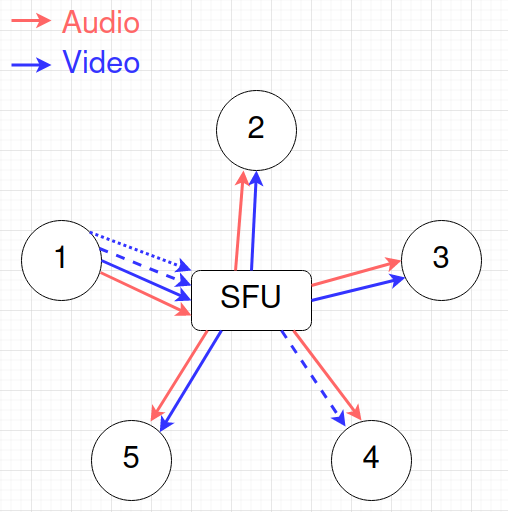

# Selective Forwarding Units (SFU)

In order to solve the challenges presented by a [P2P architecture](./p2p.md), we can introduce a central server to improve the scaling profile of upload bandwidth for each participant.  This server will handle routing of the uploaded media (audio and video) to all the other participants of the room:

With the addition of the SFU, the uploading bandwidth requirement is now only equal to the bitrate:

\\[B_u = R\\]

This removes the dependency on the number of other participants on the [producer](../definitions/producer.md) and lets anyone capable of uploading at least one stream participate in the room!

With this architecture, the burden of possessing a very high upload bandwidth rests now on the server architecture.  Luckily, datacenters generally have much better bandwidth compared to average people, with connections in excess of 1Gbps and sometimes 10Gbps.  

But there are some additional tricks the SFU can do in addition to reducing the number of upload streams for each producer.  Consider the situation where one participant happens to have a particularly bad download bandwidth, say half that of the upload bandwidth for participant 1:

In this scenario, it wouldn't make sense to ask participant 1 to lower the quality of their video.  After all, everyone else is able to handle it just fine.  There are a few ways we could handle this situation, depending on how advanced the [codec](../definitions/technologies/codecs.md) we are using is:

  * If we raise the total upload bandwidth requirement just a little bit, we can fit in a lower quality upload stream that participant 4 can use instead of the high quality stream.
  * The SFU could drop frames or sample the frames to produce a lower bitrate stream 

The first approach is known as [*simulcast*](https://en.wikipedia.org/wiki/Simulcast) and is best for when the codec we are using doesn't give us many options for modifying the encoded stream.  The second is supported in a family of more advanced codecs, collectively known as [SVC](https://en.wikipedia.org/wiki/Scalable_Video_Coding).

Under simulcast, the producer uploads multiple versions of their media, a "high quality" version followed by a few "lower quality" versions.  For example, say we have one half bitrate and one quarter bitrate "lower quality" versions uploaded along with the "high quality" version.  This has the effect of raising the total upload bandwidth requirement to just \\[B_u = 1.75R\\] still less than the requirement for a 3 person P2P model.  

This allows the SFU to select the appropriate stream to send to each participant depending on their download capabilities:

  
Simulcast

  
SVC

